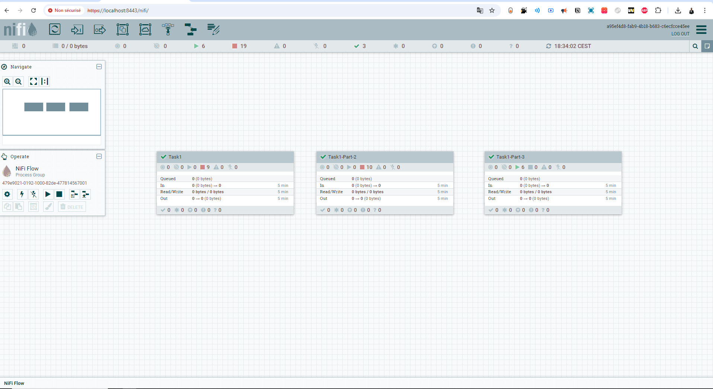

# Traitement de données JSON avec Avro et PostgreSQL via Apache NiFi

Ce repository contient des templates Apache NiFi pour la manipulation de données JSON en utilisant un schéma Avro et une base de données PostgreSQL. 

## ProcessGroup

## NIFIRegistryBuckets


## Objectifs

Ces templates permettent de réaliser les opérations suivantes :


1. **Convertir des fichiers JSON en CSV à l'aide d'un schéma Avro.**
2. **Charger des données CSV dans une base de données PostgreSQL en utilisant un schéma Avro.**
3. **Extraire des données d'une base de données PostgreSQL et les mapper dans un fichier JSON avec un schéma Avro.**

## Architecture
## company_data.json Extrait
```json
{
        "id": 44746,
        "company": "A BLUES CLOTHING",
        "country": "India (IN)",
        "countryregion": "Tamil Nadu",
        "product_spec": "Pants, trousers (PD0003) - 100% organic cotton (RM0104)nSweaters, pullovers, cardigans (PD0004) - 85% organic cotton (RM0104) + 15% recycled pre/post-consumer polyester (RM0187)nT-shirts, singlets (PD0007) - 80% organic cotton (RM0104) + 20% recycled pre/post-consumer polyester (RM0187)nSweaters, pullovers, cardigans (PD0004) - 80% organic cotton (RM0104) + 20% recycled pre/post-consumer polyester (RM0187)nPants, trousers (PD0003) - 80% organic cotton (RM0104) + 20% recycled pre/post-consumer polyester (RM0187)nBabies accessories (PD0014) - 80% organic cotton (RM0104) + 20% recycled pre/post-consumer polyester (RM0187)nSweaters, pullovers, cardigans (PD0004) - 70% organic cotton (RM0104) + 30% recycled pre/post-consumer polyester (RM0187)nT-shirts, singlets (PD0007) - 85% organic cotton (RM0104) + 15% recycled pre/post-consumer polyester (RM0187)nScarves, shawls, veils (PD0028) - 80% organic cotton (RM0104) + 20% recycled pre/post-consumer polyester (RM0187)nGloves, mittens, hand covering (PD0026) - 100% organic cotton (RM0104)nShirts, blouses (PD0005) - 100% organic cotton (RM0104)nT-shirts, singlets (PD0007) - 95% organic cotton (RM0104) + 5% elastane (RM0160)nSweaters, pullovers, cardigans (PD0004) - 100% organic cotton (RM0104)nT-shirts, singlets (PD0007) - 100% organic cotton (RM0104)nDresses, skirts (PD0011) - 100% organic cotton (RM0104)nPants, trousers (PD0003) - 97% organic cotton (RM0104) + 3% elastane (RM0160)nPants, trousers (PD0003) - 95% organic cotton (RM0104) + 5% elastane (RM0160)nSweaters, pullovers, cardigans (PD0004) - 95% organic cotton (RM0104) + 5% elastane (RM0160)nUndergarment, sleepwear, robes (PD0006) - 95% organic cotton (RM0104) + 5% elastane (RM0160)nT-shirts, singlets (PD0007) - 97% organic cotton (RM0104) + 3% elastane (RM0160)nDresses, skirts (PD0011) - 97% organic cotton (RM0104) + 3% elastane (RM0160)nActivewear, sportswear (PD0008) - 95% organic cotton (RM0104) + 5% elastane (RM0160)nDresses, skirts (PD0011) - 95% organic cotton (RM0104) + 5% elastane (RM0160)nUndergarment, sleepwear, robes (PD0006) - 100% organic cotton (RM0104)nShirts, blouses (PD0005) - 97% organic cotton (RM0104) + 3% elastane (RM0160)nShirts, blouses (PD0005) - 95% organic cotton (RM0104) + 5% elastane (RM0160)nT-shirts, singlets (PD0007) - 94% organic cotton (RM0104) + 6% elastane (RM0160)nBabies clothing (PD0013) - 100% organic cotton (RM0104)nBabies clothing (PD0013) - 95% organic cotton (RM0104) + 5% elastane (RM0160)nHats, caps, head coverings (PD0030) - 100% organic cotton (RM0104)nScarves, shawls, veils (PD0028) - 100% organic cotton (RM0104)nHats, caps, head coverings (PD0030) - 96% organic cotton (RM0104) + 4% elastane (RM0160)nHats, caps, head coverings (PD0030) - 95% organic cotton (RM0104) + 5% elastane (RM0160)nBabies accessories (PD0014) - 100% organic cotton (RM0104)nBabies clothing (PD0013) - 97% organic cotton (RM0104) + 3% elastane (RM0160)nUndergarment, sleepwear, robes (PD0006) - 97% organic cotton (RM0104) + 3% elastane (RM0160)nBabies accessories (PD0014) - 97% organic cotton (RM0104) + 3% elastane (RM0160)nOvercoats, jackets, vests (PD0001) - 97% organic cotton (RM0104) + 3% elastane (RM0160)nBabies clothing (PD0013) - 96% organic cotton (RM0104) + 4% elastane (RM0160)nBabies accessories (PD0014) - 96% organic cotton (RM0104) + 4% elastane (RM0160)nBabies accessories (PD0014) - 95% organic cotton (RM0104) + 5% elastane (RM0160)nOvercoats, jackets, vests (PD0001) - 80% organic cotton (RM0104) + 20% recycled pre/post-consumer polyester (RM0187)nUndergarment, sleepwear, robes (PD0006) - 80% organic cotton (RM0104) + 20% recycled pre/post-consumer polyester (RM0187)nBabies clothing (PD0013) - 80% organic cotton (RM0104) + 20% recycled pre/post-consumer polyester (RM0187)nBabies clothing (PD0013) - 85% organic cotton (RM0104) + 15% recycled pre/post-consumer polyester (RM0187)nHats, caps, head coverings (PD0030) - 95% organic cotton (RM0104) + 5% elastane (spandex) (RM0160)nOther (PD0100) - (Hair Band) - 95% organic cotton (RM0104) + 5% elastane (spandex) (RM0160)nOther (PD0100) - (Hair Band) - 100% organic cotton (RM0104)",
        "product_categories": "Accessories, Babywear, Ladieswear, Children's wear, Men's wear",
        "brandnames": "",
        "link_details": "/find-suppliers-shops-and-inputs/certified-suppliers/database/search_result/44746"
    },
    {
        "id": 45526,
        "company": "A D JEYAVEERAPANDIA NADAR & BROS",
        "country": "India (IN)",
        "countryregion": "Tamil Nadu",
        "product_spec": "Open-end yarns (PD0066); Normally combed yarns \n(PD0102); Carded yarns (PD0067)",
        "product_categories": "Yarns",
        "brandnames": "",
        "link_details": "/find-suppliers-shops-and-inputs/certified-suppliers/database/search_result/45526"
    },
    {
        "id": 44035,
        "company": "A G Fabrics",
        "country": "India (IN)",
        "countryregion": "Delhi",
        "product_spec": "Greige fabrics (PC0026) Woven fabrics (PD0059) -100.0% Organic Cotton (RM0104) \nDyed fabrics (PC0025) Woven fabrics (PD0059) -100.0% Organic Cotton (RM0104)",
        "product_categories": "Fabrics",
        "brandnames": "",
        "link_details": "/find-suppliers-shops-and-inputs/certified-suppliers/database/search_result/44035"
    }
```


Le repository est structuré en trois parties distinctes, chacune représentant une étape du processus de transformation des données :

### Partie 1: jsontocsv

**Nom du template:** Task1finished

**Description:** Ce template convertit un fichier JSON en format CSV en utilisant un schéma Avro pour garantir une structure de données cohérente.

**Flux de travail:**

1. **GetFile:**  Lit le fichier JSON source ("company_data.json") depuis le répertoire spécifié.
2. **SplitJson:** Divise le fichier JSON en plusieurs FlowFiles, un pour chaque enregistrement JSON.
3. **EvaluateJsonPath:** Extrait les valeurs de champs spécifiques du JSON en utilisant des expressions JsonPath.
4. **AttributesToJSON:** Convertit les attributs de FlowFile sélectionnés en un objet JSON.
5. **ConvertRecord (JsonToAvro):** Convertit l'objet JSON en un enregistrement Avro en utilisant le schéma Avro défini.
6. **ConvertRecord (AvroToCSV):** Convertit l'enregistrement Avro en un enregistrement CSV en utilisant le schéma Avro.
7. **MergeRecord:** Fusionne les enregistrements CSV individuels en un seul fichier CSV.
8. **UpdateAttribute:** Définit l'attribut "filename" du FlowFile fusionné sur "company_data.csv".
9. **PutFile:** Écrit le fichier CSV généré dans le répertoire de destination.

### Partie 2: csvtopostgesql

**Nom du template:** csvtopostgesql

**Description:** Ce template charge des données CSV dans une base de données PostgreSQL en utilisant un schéma Avro pour assurer l'intégrité des données.

**Flux de travail:**

1. **GetFile:** Lit le fichier CSV généré dans la Partie 1.
2. **SplitJson:** Divise le fichier CSV en plusieurs FlowFiles, un pour chaque ligne.
3. **EvaluateJsonPath:** Extrait les valeurs de chaque colonne CSV et les stocke en tant qu'attributs de FlowFile.
4. **AttributesToJSON:** Convertit les attributs de FlowFile en un objet JSON.
5. **ConvertRecord (JsonToAvro):** Convertit l'objet JSON en un enregistrement Avro en utilisant le schéma Avro défini.
6. **ConvertRecord (AvroToCSV):** Convertit l'enregistrement Avro en un enregistrement CSV.
7. **MergeRecord:** Fusionne les enregistrements CSV individuels en un seul fichier CSV.
8. **UpdateAttribute:** Définit l'attribut "filename" du FlowFile fusionné sur "company_data.csv".
9. **PutDatabaseRecord:** Insère les données Avro dans la table `company_data` de PostgreSQL.

### Partie 3: postgressqltocsv

**Nom du template:** postgressqltocsv

**Description:** Ce template extrait des données de PostgreSQL et les convertit en format CSV.

**Flux de travail:**

1. **QueryDatabaseTable:** Extrait les données de la table `company_data` de PostgreSQL.
2. **SplitAvro:** Divise le FlowFile Avro en plusieurs FlowFiles, un pour chaque enregistrement.
3. **ConvertAvroToJSON:** Convertit chaque enregistrement Avro en un objet JSON.
4. **MergeContent:** Fusionne les FlowFiles JSON individuels en un seul FlowFile.
5. **UpdateAttribute:** Définit l'attribut "filename" du FlowFile fusionné sur "company_data.csv".
6. **PutFile:** Écrit le FlowFile final (contenant les données JSON) dans le répertoire de destination.

## Schéma Avro

Tous les templates utilisent le même schéma Avro défini comme suit :

```json
{
  "namespace": "example",
  "type": "record",
  "name": "Company",
  "fields": [
    {"name": "id", "type": "int"},
    {"name": "company", "type": "string"},
    {"name": "country", "type": "string"},
    {"name": "countryregion", "type": "string"},
    {"name": "product_categories", "type": "string"},
    {"name": "brandnames", "type": "string"},
    {"name": "link_details", "type": "string"}
  ]
}
